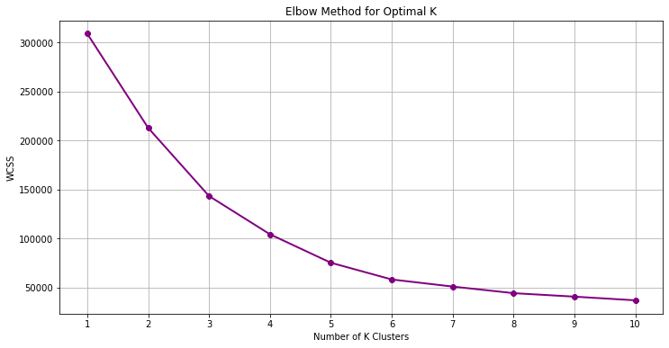
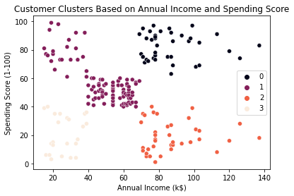

# Customer Segmentation using K-Means Clustering

This project focuses on understanding customer behavior by grouping customers based on their income and spending patterns. Instead of treating all customers the same, it shows how data can be used to identify different types of customers.

The goal is simple: find meaningful groups that can help businesses make better decisions.

## What this project does

The notebook takes a customer dataset and applies K-Means clustering to divide customers into segments. These segments highlight patterns such as high spenders, low spenders, and customers with similar financial behavior.

## Approach

- Explored and understood the dataset  
- Selected relevant features for analysis  
- Used the Elbow Method to choose the number of clusters  
- Applied K-Means clustering  
- Visualized the customer groups for interpretation  

## Tools used

- Python  
- pandas, numpy  
- matplotlib, seaborn  
- scikit-learn  

## Outcome

The project creates clear customer segments that can help in:
- targeted marketing  
- understanding spending behavior  
- identifying valuable customers  

## Key Insights

From the clustering results, a few clear patterns can be observed:

- A group of customers with high income and high spending, representing potential premium customers  
- Customers with high income but low spending, indicating an opportunity for targeted marketing  
- A segment with low income and high spending, which may reflect impulsive buying behavior  
- Lower income and low spending customers, representing a more conservative segment  

These insights show how businesses can treat each customer group differently instead of using a single strategy for everyone.

## Visual Results

Elbow Method used to determine the number of clusters:

 

The elbow point in the graph indicates the optimal number of clusters. After this point, adding more clusters does not significantly improve the model.

  

Customer segmentation based on income and spending:

 

Each color represents a different customer group. These clusters help in clearly identifying patterns in customer behavior and separating customers based on their spending habits.

## Notes

This project is a simple demonstration of how machine learning can be used to find patterns in data and turn them into useful insights. The focus is on understanding the results and their practical value rather than just applying the algorithm.
